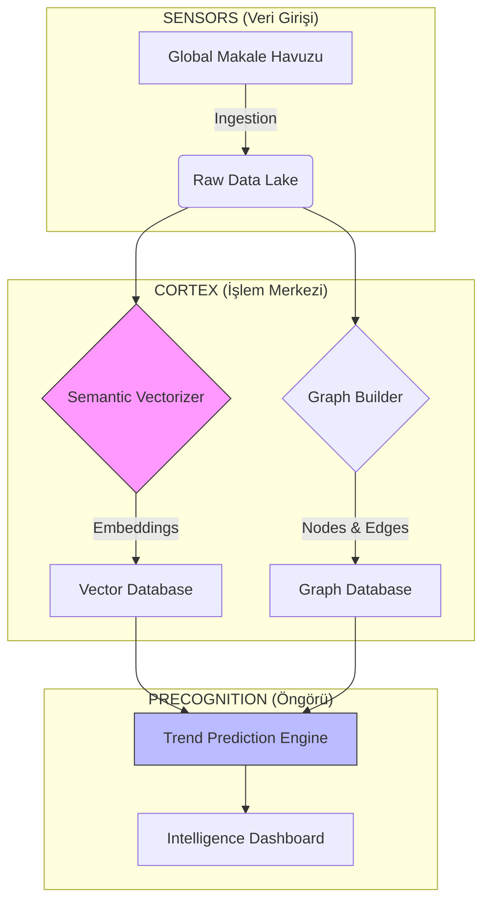

<div align="center">

# 🛰️ AKADEMİK RADAR
### *Elite Academic Intelligence & Predictive Analytics Platform*

[](https://github.com/bahattinyunus/AkademikRadar)
[](https://github.com/bahattinyunus/AkademikRadar)
[](https://github.com/bahattinyunus/AkademikRadar)
[](LICENSE)

> **"Geleceği tahmin etmenin en iyi yolu, onu veriden inşa etmektir."**
> *"The best way to predict the future is to construct it from data."*

[Manifesto](#-manifesto-bilginin-kartografisi) • [Neural Architecture](#-neural-architecture-ve-teknik-derinlik) • [Ignition](#-ignition-sistemi-ba%C5%9Flatma) • [Project Architect](#-project-architect-system-creator)

</div>

---

## 🌌 MANIFESTO: Bilginin Kartografisi

Bilimsel üretim hızı, insan algısının sınırlarını çoktan aştı. Her gün yayınlanan binlerce makale, insanlığın kolektif hafızasına eklenen yeni nöronlardır.

> **Daha derin felsefemizi okumak için: [📄 MANIFESTO.md](MANIFESTO.md)**

**Akademik Radar**, bu kaosu düzenlemek için inşa edilmiş bir **Meta-Analiz ve İstihbarat Motorudur**. Şimdi **LIVE DATA (ArXiv)** desteği ile gerçek zamanlı çalışmaktadır.

### 🔭 Vizyon (The Vision)
Amacımız, statik bir arama motoru olmak değildir. Amacımız, akademik literatürün **canlı, nefes alan ve sürekli genişleyen bir haritasını** çizmektir.
*   Biz sadece "ne olduğunu" göstermiyoruz.
*   Biz "neyin gelmekte olduğunu" (**Predictive Trend Analysis**) gösteriyoruz.
*   Görünmeyen bağlantıları (**Hidden Latent Links**) ortaya çıkarıyoruz.

---

## 🧠 NEURAL ARCHITECTURE ve Teknik Derinlik

Bu platform, basit bir web kazıyıcı (scraper) değildir. Modern yapay zeka ve çizge teorisinin (Graph Theory) birleşiminden oluşan bir **Sibernetik Organizmadır**.

### 1. Nöral Semantik Motor (The NLP Core)
Kelime eşleşmesi (Keyword Matching) ilkeldir. Biz **Anlam Uzayı** (Semantic Space) kullanıyoruz.
*   **Transformer Models:** `BERT` ve `SciBERT` modelleri kullanılarak her makale 768 boyutlu bir vektöre dönüştürülür.
*   **Contextual Awareness:** "Viral Enfeksiyon" araması yaptığınızda, sistem "Sitokin Fırtınası" makalelerini de getirir, çünkü bu kavramların tıbbi uzayda komşu olduğunu matematiksel olarak bilir.

### 2. Holografik Atıf Ağı (Holographic Citation Mesh)
Bilgi lineer değildir; ağsaldır.
*   **Graph Algorithms:** `PageRank` ve `HITS` algoritmalarıyla sadece çok atıf alanları değil, "merkeziyeti" (Centrality) yüksek olan kilit makaleleri (Hubs) tespit ediyoruz.
*   **Community Detection:** `Louvain` algoritması ile disiplinler arası gizli kümeleri (Clusters) buluyoruz.

### 3. Zaman Serisi ve Anomali Tespiti (Temporal Oracle)
*   **Weak Signal Detection:** Bir konu henüz "trend" olmadan önce, literatürde "zayıf sinyaller" verir. Sistemimiz bu anormallikleri (Anomalies) yakalar ve gelecekteki araştırma fonlarının nereye akacağını bugünden tahmin eder.



---

## 🔥 IGNITION: Sistemi Başlatma

Akademik Radar, terminal tabanlı elit bir arayüze (CLI) sahiptir.

### 💾 Kurulum (Installation)

```bash
# 1. Depoyu klonlayın
git clone https://github.com/bahattinyunus/AkademikRadar.git
cd AkademikRadar

# 2. Protokolleri yükleyin (Requirements)
pip install -r core_requirements.txt
```

### 🚀 Başlatma (Launch)

Sistemi tam güçte çalıştırmak ve simülasyonu izlemek için:

```bash
python ignite_radar.py --full
```

**Sistem Yanıtı (Örnek):**
> *Scanning Frequency Bands...*
> *Loading Neural Weights [####################] 100%*
> *Detected Signal: Quantum Computing | Intensity: 97%*

---

## 🗺️ STRATEGIC HORIZON (Roadmap 2030)

*   **2025 Q3:** Gerçek zamanlı arXiv taraması entegrasyonu.
*   **2026 Q1:** "Akademik LinkedIn" - Yazarlar arası işbirliği öneri motoru.
*   **2028:** Tam Otonom Literatür Tarama (Siz konuyu verin, o size 100 sayfalık özet rapor yazsın).
*   **2030:** **Project: OMNISCIENCE** - Tüm dünya dillerindeki makalelerin anlık evrensel çevirisi ve analizi.

---

## 👨‍💻 PROJECT ARCHITECT (System Creator)

<div align="center">

### **Bahattin Yunus Çetin**
*Architect of Digital Systems | Data Visionary*

*"I don't just write code; I weave logic into existence."*
<br>

Büyük veri okyanusunda bir deniz feneri inşa ediyorum. Trabzon'dan yönetilen bu operasyon, global bilginin sınırlarını zorlamayı hedefleyen bir **tek kişilik dev kadro** projesidir.

[](https://www.linkedin.com/in/bahattinyunus/)
[](https://github.com/bahattinyunus)

</div>

---

<div align="center">
<sub>© 2024-2025 Akademik Radar Intelligence. All Systems Operational.</sub>
</div>
